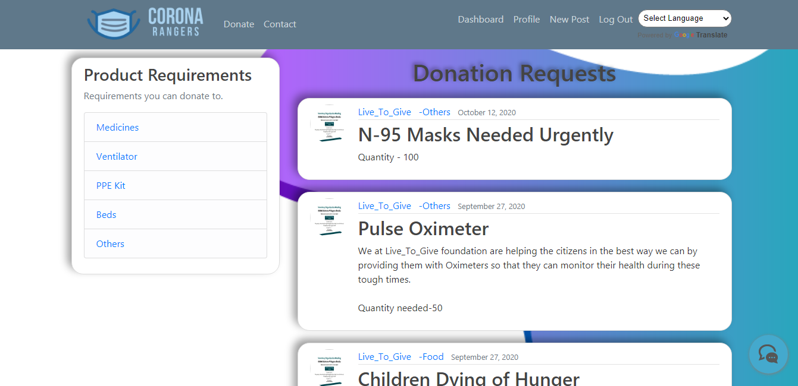
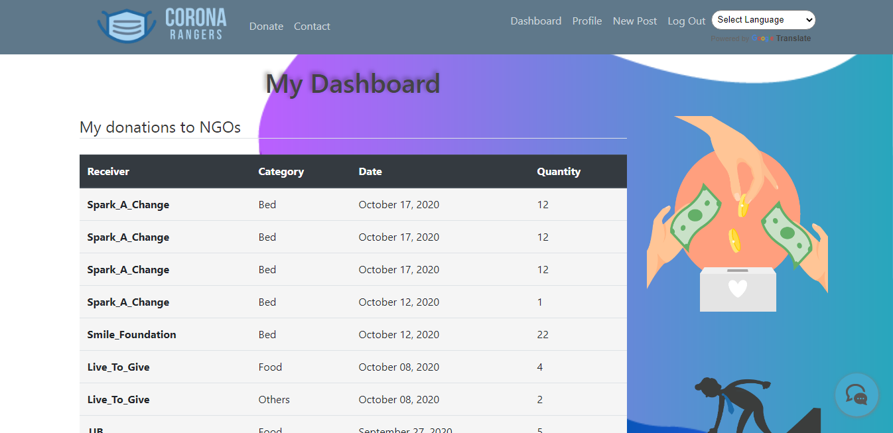

# Corona-Rangers
During these tough times, COVID is a huge obstacle we all had to face, especially for the needy and for people who don't access to many facilities. Even NGOs are having a difficult time help the needy. You could make a small effort by donating something that could save a person's life. Hence our platform allows NGOs and donors to easily connect help out each other. 

## Website Link: http://jaar1.pythonanywhere.com/

## Home Page

## Register Page

## Donation Requests

## Dashboard

## Multi Language Support

## Functional Contact Page with Chatbot support for users

## How to run project
 - Star and clone this repo
 - activate your virtualenv
 - run: `pip install -r requirements.txt` in your shell
 - run: `python manage.py runserver` in your shell
